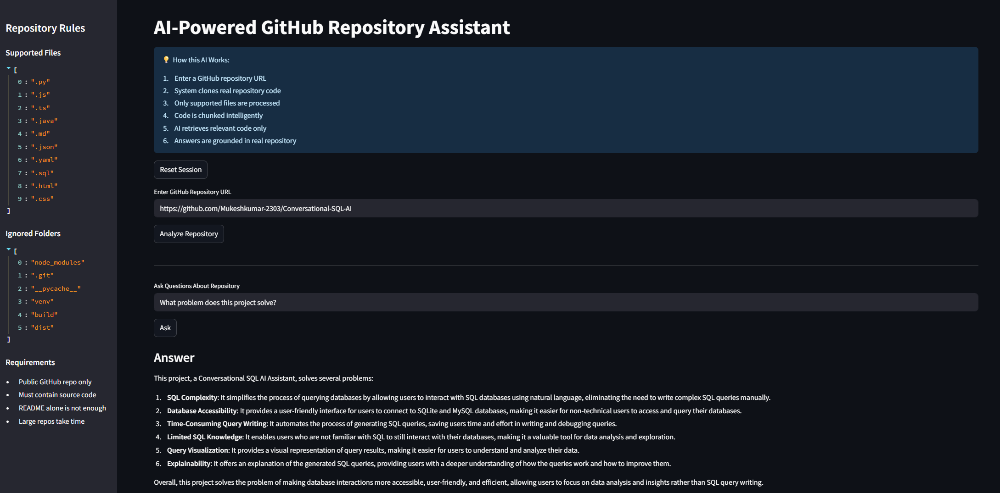
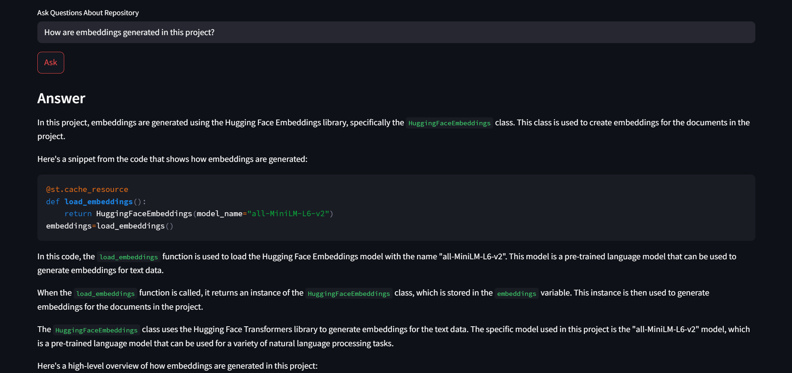

---

# **AI-Powered GitHub Repository Knowledge Assistant**

An AI-powered GitHub repository analysis tool built with Streamlit, LangChain, and LLMs that allows users to understand any GitHub repository using natural language.

This project converts GitHub repository code into embeddings and enables intelligent question answering using Retrieval-Augmented Generation (RAG).

---



---

## **AI GitHub Repository Assistant enables users to:**

* Analyze any public GitHub repository using a URL
* Understand repository structure and architecture
* Ask natural language questions about code
* Retrieve answers directly from source code
* Explore file-level implementation details
* Detect how components interact inside a project

The system uses LangChain RAG pipelines with vector databases for accurate and context-aware responses.

---



---

## **Features**

### AI-Powered Code Understanding

* Converts GitHub repository code into embeddings
* Retrieves relevant code chunks for every question
* Generates accurate answers using LLM reasoning

---

### Repository Analysis

* Automatically clones GitHub repositories
* Parses source code files
* Extracts project structure
* Identifies modules and components

---

### File-Level Intelligence

* Explains individual files and functions
* Shows source file references for every answer
* Supports deep code-level questioning

---

### Supported File Types

* Python (.py)
* JavaScript (.js)
* TypeScript (.ts)
* Java (.java)
* Markdown (.md)
* JSON (.json)
* YAML (.yaml)
* SQL (.sql)
* HTML (.html)
* CSS (.css)

---

### Safe Repository Processing

Only safe read operations are performed.

The system does NOT:

* Modify repositories
* Execute code from repositories
* Store user credentials
* Run destructive operations

---

## **Intelligent Retrieval (RAG System)**

The system works using:

* Code chunking (function/class level)
* Embedding generation
* Vector similarity search
* Context-aware LLM responses

This ensures answers are strictly based on actual repository code.

---

## **File Structure Awareness**

The system provides:

* Accurate file structure detection
* Repository tree visualization
* Clean file path representation
* No hallucinated file names

---

## **Example Use Cases**

* Understand unfamiliar GitHub repositories
* Analyze open-source projects
* Debug codebases quickly
* Learn project architecture
* Explore backend/frontend logic

---

## **Example Queries**

### Repository Overview

```text
What is this project about?
Explain this repository in simple terms.
```

### File Structure

```text
Show file structure of this repository
List all files in this project
```

### Code Understanding

```text
How does this project work internally?
Explain the backend logic
```

### Deep Analysis

```text
Which file handles embeddings?
How is the vector database created?
Where is GitHub cloning implemented?
```

---

## **Tech Stack**

### Frontend

* Streamlit

### Backend

* Python

### AI / LLM

* LangChain
* Groq / OpenAI / Ollama

### Embeddings

* HuggingFace Transformers
* Sentence Transformers
* CodeBERT

### Vector Database

* FAISS / ChromaDB

### Repository Handling

* GitPython

---

## **System Workflow**

```text
GitHub URL
   ↓
Clone Repository
   ↓
Parse Code Files
   ↓
Chunk Code (functions/classes)
   ↓
Generate Embeddings
   ↓
Store in Vector Database
   ↓
User Question
   ↓
Retrieve Relevant Code
   ↓
LLM Generates Answer
```

---

## **Limitations**

* Large repositories may take time to process
* Complex distributed systems may not be fully interpreted
* Requires structured repositories for best performance

---

## **Future Improvements**

* GitHub Copilot-style UI
* Clickable file explorer
* Syntax-highlighted code viewer
* Chat per file functionality
* Architecture diagram generation
* Multi-repository support
* Real-time GitHub sync

---

## **Output Principle**

The system strictly answers using retrieved repository context.
If information is not found in the repository, it clearly states that.

---

## **Author**

Built as an AI-powered RAG system for:

* Code understanding
* Repository exploration
* Developer productivity

---
[Live Demo](https://url8mibebgcsav3do3qpgj.streamlit.app/)
